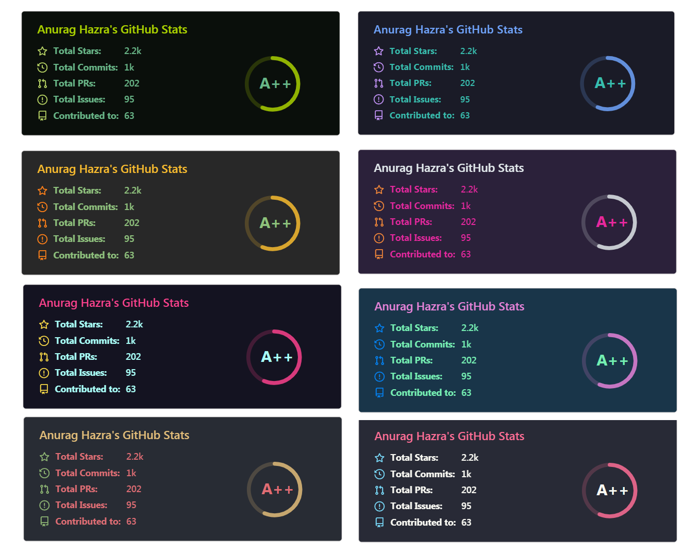
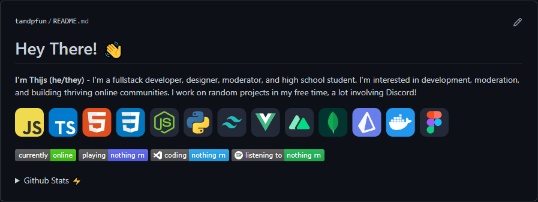
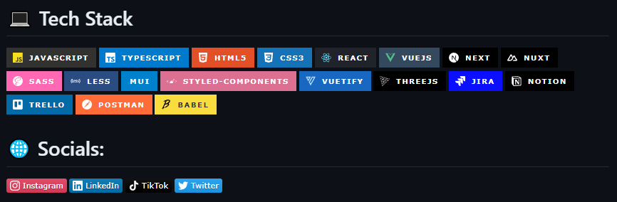
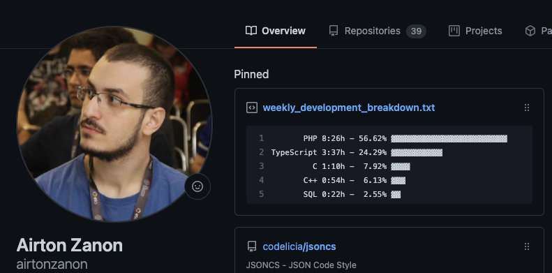
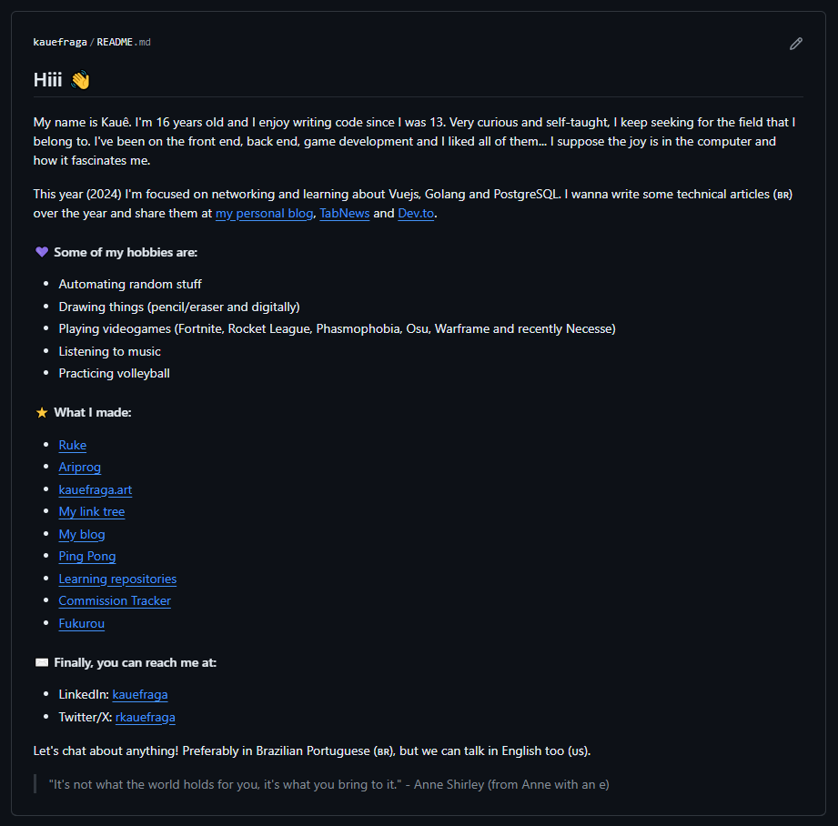
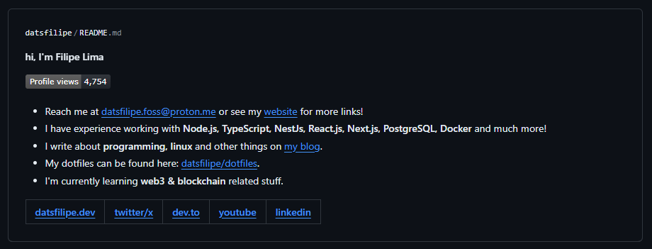
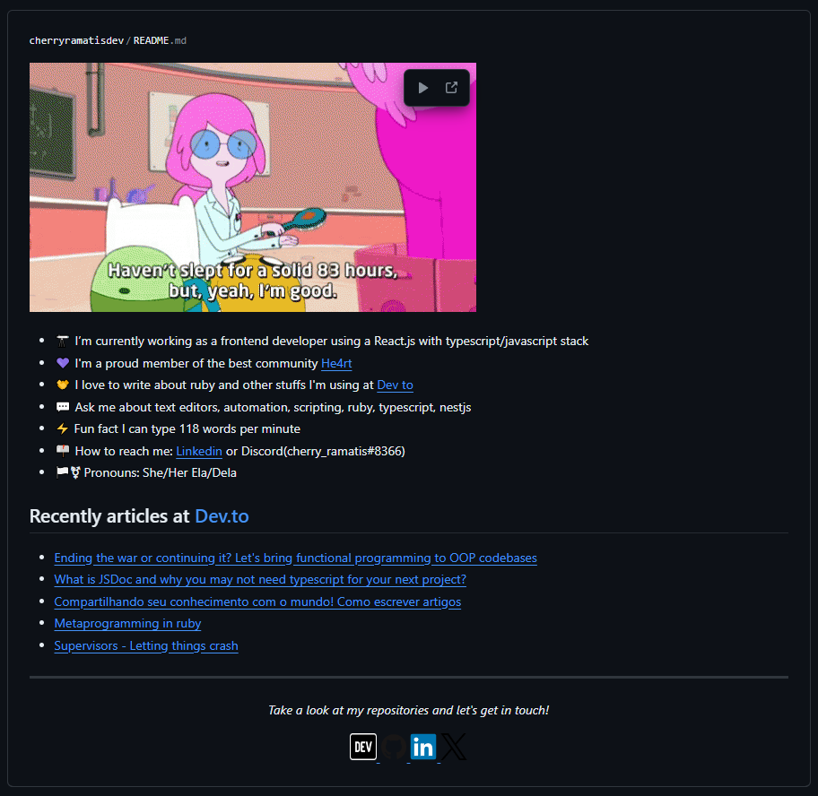
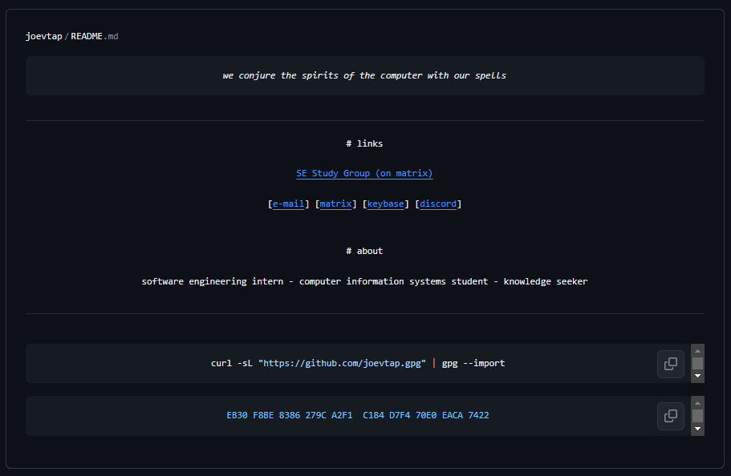

+++
title = 'Personalizando o README do seu perfil do GitHub'
summary = ' '
date = 2024-05-12
author = ['Kauê Fraga Rodrigues']
+++

Opa, tranquilo? Bora deixar o README do teu GitHub bonitão!

Antes de começar realmente, se você não sabe o que é README nem markdown eu recomendo fortemente que veja os outros artigos dessa série.

O README do GitHub é o cartão de visita do seu perfil. Antes de personalizar ele, você precisa criar ele.

## Criando README

Crie um repositório com o mesmo nome do seu perfil. Como meu nome de usuário é "kauefraga" o nome do repositório seria "kauefraga" também.

Para facilitar seu trabalho já inclua o arquivo README no seu repositório.

Feito isso você está pronto para customizar o seu README.

Eu recomendo que você coloque as seguintes informações:

- O que você gosta de fazer
- Planos para o ano atual
- Projetos
- As tecnologias (tech stack) e ferramentas que você usa
- Contato

Vale ressaltar que o README deve ficar com a sua cara, com o que você gostar e achar que deve ter. Reflita sua extravagância, seu minimalismo, suas cores favoritas, tudo que te represente.

Para editar pelo próprio GitHub clique no lápis para editar, veja a seguir.

A partir de agora é contigo, totalmente pessoal. Vou deixar vários materiais e inspirações de estilos e layouts.

Uma coisa que eu gostaria de ressaltar, eu gosto de ter um README bonitinho e algumas pessoas (recrutadores, outros desenvolvedores, etc.) olham sim, porém não leve tão a sério. Faça porque você quer falar um pouco sobre quem você é e expor informações técnicas suas.

### GitHub Readme Stats

Com esses cards você pode mostrar informações relevantes do seu perfil do GitHub e personalizar as cores.

Veja o [repositório](https://github.com/anuraghazra/github-readme-stats) ou vá direto para a [seção dos cards](https://github.com/anuraghazra/github-readme-stats?tab=readme-ov-file#github-stats-card).

### Skill Icons

Quer expor as tecnologias que você usa, está estudando ou querendo estudar? Tá na mão!

Veja o [site](https://skillicons.dev/) ou vá direto na [documentação](https://github.com/tandpfun/skill-icons#specifying-icons).

> Se você não viu ainda, na seção [sobre mim](https://kauefraga.github.io/blog/about/#sobre-mim) do blog eu uso os _skill icons_.

### Markdown Badges

Veja o [repositório markdown badges](https://github.com/Ileriayo/markdown-badges) e o [badges for readme.md profile](https://github.com/alexandresanlim/Badges4-README.md-Profile).

### Snake Game

Você deve conhecer o jogo da cobrinha, certo? Imagina uma cobrinha comendo suas contribuições no seu gráfico de contribuições.

Veja o [repositório](https://github.com/Platane/snk) e um [tutorial de como adicionar no seu perfil](https://dev.to/henriquelopes42/como-adicionar-o-snake-game-jogo-da-cobrinha-no-seu-perfil-do-github-40m2).

### Wakatime

Quer exibir métricas do seu tempo em _x_ projeto ou usando _y_ linguagem de programação? Comece a usar o [wakatime](https://wakatime.com/) e veja esse artigo também, ["Exibindo no Github métricas de tempo gasto em linguagens usando Wakatime"](https://airton.dev/article/exibindo-no-github-metricas-de-tempo-gasto-em-linguagens-usando-wakatime/).

## Inspirações

Não tem nada melhor que ter opções para se inspirar, né? Aqui vão alguns READMEs que eu considero legais. Clique na imagem para ir até o README.

Começando com o meu 😂

Sem frufru? Olha esse do Filipe

Simples mas nem tanto? O Lucas amassou aqui

Nessa mesma ideia, a Tifany arrasou também

Continuando...

## Recomendações

- [Como personalizar o seu perfil no Github (Readme) da Rafaella Ballerini](https://youtu.be/TsaLQAetPLU)
- [Guia resumido da Laura Kibum](https://twitter.com/kibumLaura/status/1754254161615491117)

Estarei aberto para dúvidas ou sugestões pelo [Twitter/X](https://twitter.com/rkauefraga).

Muito obrigado por ter lido até aqui ❤.
