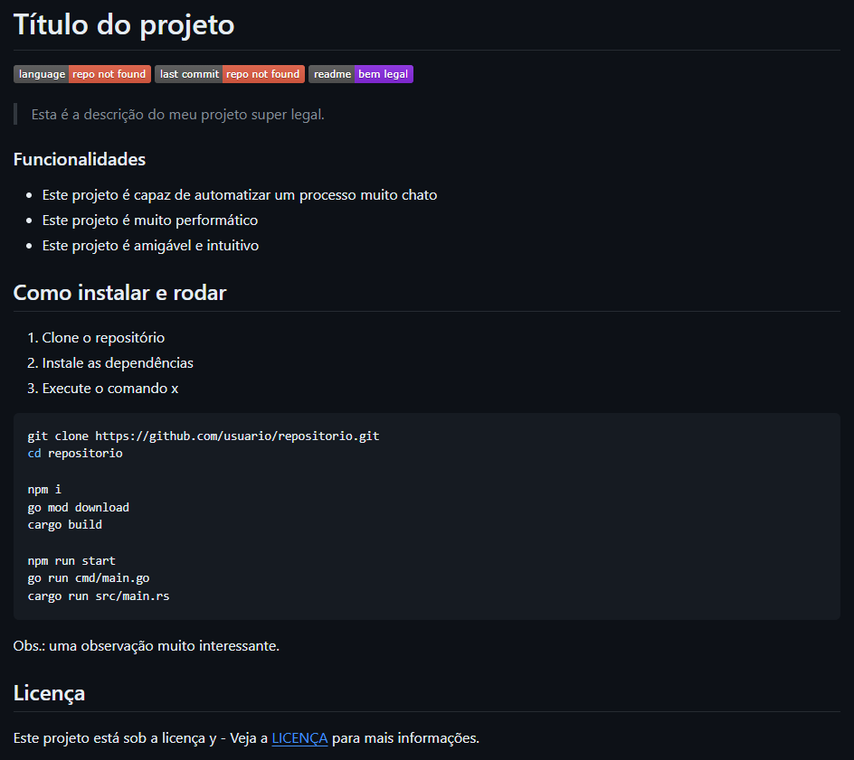

Pensei em criar três postagens sobre readmes.

- Aprenda a fazer um readme
- Personalizando o readme do seu projeto
- Personalizando o readme do seu perfil do GitHub

1. Introdução
	- saudação
	- ideia principal (motivação para eu escrever e para o leitor ler)
2. Desenvolvimento
	- básico de markdown e sua importância + cuidado com marcações específicas (principalmente GitHub)
	- estrutura principal (cabeçalho, corpo e rodapé/final)
	- o que abordar e o que não
	- como ter ideias/referências
	- como colocar badges legais
3. Conclusão
	- resumo (too long; didn't read)
	- agradecimento

# Introdução ao markdown e aos READMEs

Olá, tudo certo?

Hoje vou falar sobre o que é um README, o que é markdown, como escrever um README básico e por que você deveria aprender a sintaxe markdown e escrever READMEs. Bora?

## O que é um README

Começando pelo começo, você provavelmente já viu projetos de outros desenvolvedores ou instalou um projeto, uma solução ou um jogo de origem duvidosa e se deparou com aquele arquivo `README`, `README.txt` ou `README.md`. Caso nunca tenha visto, tudo bem.

A tradução de *read me* é "leia me" e, resumidamente, um README é um arquivo que fica junto de um projeto e serve como um cartão de visita para o mesmo, contendo informações sobre o projeto como: objetivo, capacidade, instalação, documentação em geral, licença, etc.

Deu pra perceber a importância dos READMEs?

Um README geralmente é escrito em markdown, uma linguagem de marcação assim como o HTML. Dito isso, a forma mais comum desse arquivo é essa: `README.md`.

## O que é markdown

Markdown é uma linguagem de marcação simplificada e de fácil uso. O primeiro processador de markdown foi o próprio [Markdown](https://daringfireball.net/projects/markdown) feito pelo John Gruber com a linguagem de programação Perl. Ele tinha o objetivo de ser uma ferramenta de conversão de markdown para HTML.

Atualmente existem vários processadores Markdown e variações (ou *supersets*) da sintaxe, permitindo novas marcações e diferentes saídas. Por exemplo, de markdown para PDF.

Veja um resumo ou *cheatsheet* da sintaxe markdown:

```
# Isto é um título ou um h1 em HTML
## Isto é um subtítulo ou um h2 em HTML
### Você já entendeu... vai até o h6 ou ######

Isto é um parágrafo e a palavra **negrito** está em negrito, enquanto a palavra *itálico* está em itálico. ~~riscado~~ e [link](https://example.com).

- eu sou um item em uma lista desordenada
- eu sou outro item na lista desordenada
- eu sou mais um item

> Uma citação blablablablablabla

1. eu sou o primeiro item de uma lista ordenada
2. eu sou o segundo item
3. eu sou o terceiro!


---

Estou abaixo do divisor horizontal.
```

E o resultado:

## Isto é um subtítulo ou um h2 em HTML
### Você já entendeu... vai até o h6 ou ######

Isto é um parágrafo e a palavra **negrito** está em negrito, enquanto a palavra *itálico* está em itálico. ~~riscado~~ e [link](https://example.com).

- eu sou um item em uma lista desordenada
- eu sou outro item na lista desordenada
- eu sou mais um item

> Uma citação blablablablablabla

1. eu sou o primeiro item de uma lista ordenada
2. eu sou o segundo item
3. eu sou o terceiro!


---

Estou abaixo do divisor horizontal.

Uma ótima referência para você se aprofundar é o [Markdown Guide](https://www.markdownguide.org).

## Por que aprender markdown e escrever READMEs

Escrever é algo muito importante na vida de um desenvolvedor. Todo projeto, decisão ou solução deveria ter uma documentação que defina, explique e/ou demonstre essas coisas.

Saber markdown facilita muito sua vida ao oferecer uma sintaxe simples e ser convertido em HTML, além de ser quase uma convenção (se não for) no quesito escrita técnica.

## Resumo (tl;dr)

Markdown é uma linguagem de marcação que tem uma sintaxe simples, pode ser convertida para HTML e, com isso, ela pode ser usada para escrever textos formatados. Por ser fácil de ler e escrever, o markdown tem uma alta adoção na comunidade de desenvolvimento de software.

O README é como um cartão de visitas e serve para expor os detalhes mais relevantes de um projeto. Pode ser qualquer tipo de arquivo mas normalmente é escrito usando markdown, então um README geralmente tem a extensão `.md` para demonstrar isso.

Para conhecer a sintaxe, veja essa *cheatsheet*: [Markdown Cheat Sheet](https://www.markdownguide.org/cheat-sheet).

**Fun fact**: esse texto foi escrito inteiramente em markdown e faz parte de uma série sobre READMEs :)

Obrigado por ler ❤

# Personalizando o README do seu projeto

Opa, tudo tranquilo?

Continuando a série sobre READMEs, agora vamos falar da personalização 🤩

Vamos usar markdown para customizar o README do seu projeto com seções, frases, ícones/insígnias, etc. Se você não tem ideia do que é markdown e README, recomendo ler o primeiro artigo desta série, [Introdução ao markdown e aos READMES](https://www.tabnews.com.br/kauefraga/introducao-ao-markdown-e-aos-readmes).

## Estruturando o README

Pense no **modo que você quer expor as informações do seu projeto**. Defina uma hierarquia e use vários identificadores (seções, negrito, código...).

Depois de fazer alguns projetos e espiar um bocado de projetos alheios, eu normalmente estruturo meu projeto da seguinte forma:

1. Título ou nome do projeto
2. Descrição
3. Funcionalidades
4. Como instalar/rodar/usar
5. Licença

É isso! Simples, não?

Você pode adicionar mais informações, mas eu acredito que essas sejam essenciais.

Se você não sabe o que adicionar, pense em quais informações são importantes para o projeto. Eu tenho algumas sugestões:

- documente as tecnologias e a escolha delas
- descreva a arquitetura, os padrões de projetos e o porquê dessas decisões
- dedique uma seção a sua API (interna ou não)
- liste as variáveis de ambiente necessárias para executar o projeto
- exemplifique a utilização do projeto (código ou imagem/vídeo)
- explique os passos necessários para contribuir
- mencione os contribuidores
- diga se tem testes e como roda-los

## Estilizando essas informações com markdown

Fique atento, em algumas partes eu vou adicionar só a opção discutida (incremental mesmo) e em outras eu vou reescrever boa parte do código já mostrado porque alguma coisinha ali foi alterada.

### Especifique o título

**Dica**: tente criar um nome explicativo e memorável para o seu projeto, por mais difícil que isso seja 😅

```md
# Título do projeto
```

Centralizado:

```md
<h1 align='center'>Nome do projeto</h1>
```

Não é possível centralizar com markdown, por isso usamos HTML.

### Adicione insígnias legais ao seu projeto

Veja no site [shields.io](https://shields.io). Segue as que eu mais uso:

- Linguagem mais utilizada
- Último commit
- Palavras/frase estática
- Licença
- Downloads (GitHub releases, crates.io, npm...)
- Versão mais recente

```md
# Título do projeto


```

Centralizado:

```md
<div align='center'>
	<h1>Nome do projeto</h1>
	
	
	
</div>
```

Lembre-se de trocar as informações `:nomedeusuario` e `:nomedorepositorio`.

### Coloque uma descrição

```md
# Título do projeto


Esta é a descrição do meu projeto super legal.
```

Descrição como citação:

```md
> Esta é a descrição do meu projeto super legal.
```

Centralizado:

```md
<div align='center'>
	<h1>Nome do projeto</h1>
	<p>Esta é a descrição do meu projeto super legal.</p>
	
	
	
</div>
```

### Diga quais são as funcionalidades

As funcionalidades podem ser capacidades, rotas ou o que seu projeto fizer.

```md
### Funcionalidades

- Este projeto é capaz de automatizar um processo muito chato
- Este projeto é muito performático
- Este projeto é amigável e intuitivo
```

```md
## Features

- [x] Este projeto é capaz de receber requisições e responder
- [x] Este projeto é capaz de lidar com requisições simultaneamente, graças ao controle de concorrência implementado
- [ ] Este projeto pode teletransportar uma pessoa para qualquer lugar do planeta a qualquer momento
```

Perceba a alteração das palavras (funcionalidades e features), nível da seção (h3 e h2) e lista (não-marcada e marcada). Faça como quiser.

### Como instalar e rodar

Aqui você precisa descrever o processo de instalação e execução/utilização do seu projeto.

```md
## Como instalar e rodar

1. Clone o repositório
2. Instale as dependências
3. Execute o comando x

<----->bash
git clone https://github.com/usuario/repositorio.git
cd repositorio

npm i
go mod download
cargo build

npm run start
go run cmd/main.go
cargo run src/main.rs
<----->

Obs.: uma observação muito interessante.
```

Substitua esses `<----->` por crases triplas (bloco de código).

### Exponha a licença

```md
## Licença

Este projeto está sob a licença y - Veja a [LICENÇA](https://github.com/usuario/repositorio/blob/main/LICENSE) para mais informações.
```

## Resultado final

Veja como ficou o README copiando e colando direto daqui:



Basicamente é isso. Lembra que o README é um "cartão de visitas" para o seu projeto? O que você quer mostrar aos seus visitantes? Você deve montar seu README pensando nas informações que são relevantes para o seu projeto. A partir disso, escreva e refine ao longo do tempo.

**Fun fact**: dependendo do lugar que você pretende colocar seu README (GitHub, GitLab, Bitbucket...) pode existir um *superset* do markdown como diz [o Markdown Guide em *extended syntax*](https://www.markdownguide.org/extended-syntax/#lightweight-markup-languages), que adiciona marcações e melhora o comportamento de algumas existentes.

Se você usa o Visual Studio Code para escrever seus READMEs, eu tenho extensões para recomendar:

- [Markdown Checkbox](https://marketplace.visualstudio.com/items?itemName=bierner.markdown-checkbox)
- [Markdown Emoji](https://marketplace.visualstudio.com/items?itemName=bierner.markdown-emoji)
- [Markdown Mermaid (diagramas e fluxogramas)](https://marketplace.visualstudio.com/items?itemName=bierner.markdown-mermaid)
- [Markdown GitHub Styles](https://marketplace.visualstudio.com/items?itemName=bierner.markdown-preview-github-styles)
- [Markdown Lint](https://marketplace.visualstudio.com/items?itemName=DavidAnson.vscode-markdownlint)

Também selecionei alguns dos meus melhores READMEs para você ter uma ideia de como eu faço:

- [esquilo aniquilador](https://github.com/kauefraga/esquilo-aniquilador)
- [eco](https://github.com/kauefraga/eco)
- [ariprog](https://github.com/kauefraga/ariprog)
- [anime archive](https://github.com/kauefraga/anime-archive)
- [node typescript server](https://github.com/kauefraga/node-typescript-server)

Obrigado por ler 💜

# Personalizando o README do seu perfil do GitHub

[[Interagindo com devs]]
