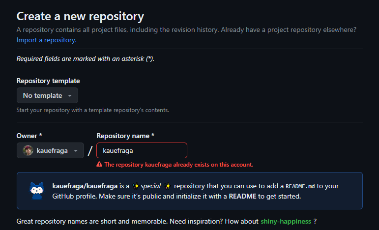

# Personalizando o README do seu perfil do GitHub

Opa, tranquilo? Bora deixar o README do teu GitHub uma belezura!

Antes de começar realmente, se você não sabe o que é README nem markdown eu recomendo fortemente que veja os outros artigos dessa série.

O README do GitHub é o cartão de visita do seu perfil. Antes de personalizar ele, você precisa criar ele.

## Criando README

Crie um repositório com o mesmo nome do seu perfil. Como meu nome de usuário é "kauefraga" o nome do repositório seria "kauefraga" também.

<h6 align="center">O erro é porque eu já tenho esse repositório.</h6>

Para facilitar seu trabalho já inclua o arquivo README no seu repositório.

Feito isso você está pronto para customizar o seu README.

Eu recomendo que você coloque as seguintes informações:

- O que você gosta de fazer
- Planos para o ano atual
- Projetos
- As tecnologias (tech stack) e ferramentas que você usa
- Contato

Vale ressaltar que o README deve ficar com a sua cara, com o que você gostar e achar que deve ter. Reflita sua extravagância, seu minimalismo, suas cores favoritas, tudo que te represente.

Para editar pelo próprio GitHub clique no lápis para editar, veja a seguir.

A partir de agora é contigo, totalmente pessoal. Vou deixar vários materiais e ideias de estilos.

### GitHub Readme Stats

Veja [o repositório](https://github.com/anuraghazra/github-readme-stats).

### Skill Icons

Veja [o site](https://skillicons.dev/).

### Markdown Badges

Veja [o repositório](https://github.com/Ileriayo/markdown-badges).

## Recomendações

- [Como personalizar o seu perfil no Github (Readme) da Rafaella Ballerini](https://youtu.be/TsaLQAetPLU)
- [Guia resumido da Laura Kibum](https://twitter.com/kibumLaura/status/1754254161615491117)
