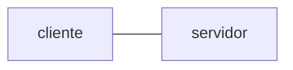
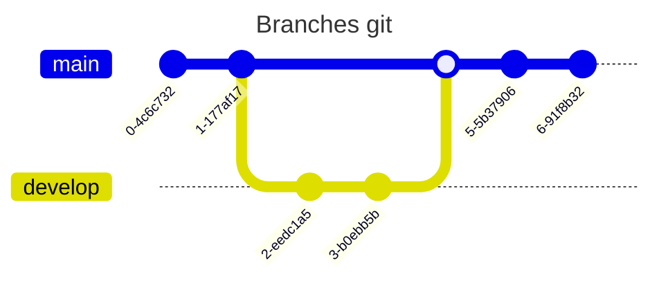

Salve, salve! Vamos aprofundar nossos conhecimentos em markdown.

Este é o quarto capítulo de uma série sobre markdown, caso queira ler os capítulos anteriores

1. [Introdução ao markdown e aos READMEs](https://dev.to/kauefraga/aprenda-a-fazer-um-readme-4n36)
2. [Personalizando o README do seu projeto](https://dev.to/kauefraga/personalizando-o-readme-do-seu-projeto-51jm)
3. [Personalizando o README do seu perfil do GitHub](https://dev.to/kauefraga/personalizando-o-readme-do-seu-perfil-do-github-52ke)

Sem mais delongas, bora pro markdown!

## Lista de tarefas

Você deve conhecer as listas ordenadas e não-ordenadas, correto?

- fulano
- ciclano
- beltrano

1. item
2. item
3. item

E se eu te dissesse que é possível fazer uma lista com marcações?

```md
- [x] tarefa x
- [ ] tarefa y
- [ ] tarefa z
```

- [x] tarefa x
- [ ] tarefa y
- [ ] tarefa z

## Tabelas

Com linhas e colunas, uma tabela pode melhor a visualização e facilitar a busca de informações.

```md
| Coluna 1 | Coluna 2 | Coluna 3 |
|----------|----------|----------|
| Item 1   | Item 1   | Item 1   |
```

Resultado:

| Coluna 1 | Coluna 2 | Coluna 3 |
|----------|----------|----------|
| Item 1   | Item 1   | Item 1   |

Você pode escolher como os textos ficam alinhados e usar os estilos de texto dentro da tabela também.

Coloque `:` no início do divisor e as células vão ficar alinhadas à esquerda. No final, alinhadas à direita. E se você colocar `:` no início e no fim do divisor o texto vai ficar centralizado.

Um exemplo:

```md
| Nome completo  |         Idade |
|:--------------:|--------------:|
|  João `Silva`  | <kbd>27</kbd> |
| Ana *Carvalho* |            20 |
| Beatriz Souza  |        **35** |
```

| Nome completo  |         Idade |
|:--------------:|--------------:|
|  João `Silva`  | <kbd>27</kbd> |
| Ana *Carvalho* |            20 |
| Beatriz Souza  |        **35** |

A tag `kbd` serve pra mostrar entradas do teclado, veja mais na [documentação da mdn sobre kbd](https://developer.mozilla.org/en-US/docs/Web/HTML/Element/kbd).

Sobre tabelas é isso, bem simples, não?

A formatação das tabelas no markdown pode dificultar bastante a leitura, então tente sempre manter as tabelas bem formatadas.

Uma dica pra quem usa o Visual Studio Code: instale a extensão [Markdown Table Prettifier](https://marketplace.visualstudio.com/items?itemName=darkriszty.markdown-table-prettify).

## Vídeos

Colocar uma demonstração visual de um conceito ou projeto pode ser poderoso, mas nem todos os processadores de markdown tem uma sintaxe pronta pra isso.

A forma mais simples e totalmente compatível é usando HTML puro.

```html
<div align="center">
  <video width="320" height="240" controls>
    <source src="video.mp4" type="video/mp4" />
  </video>
  <p>esta é a legenda do vídeo (caption)</p>
</div>
```

<div align="center">
  <video width="500" height="300" controls>
    <source src="video.mp4" type="video/mp4" />
  </video>
  <p>sim, não tem um vídeo -_-</p>
</div>

A `div` para centralizar e o parágrafo (`p`) não são necessários, você pode remover caso queira. Recomendo que dê uma olhada na [documentação da tag `video`](https://developer.mozilla.org/pt-BR/docs/Web/HTML/Element/video).

Não testei mas quero compartilhar que de acordo com uma [postagem no blog do GitHub](https://github.blog/news-insights/product-news/video-uploads-available-github/) é possível apenas colocar um link que termine com a extensão mp4 ou mov e o GitHub cuida da renderização para você.

Outra forma de expor uma demonstração é usando um gif, que foi o que eu fiz no projeto [Ruke](https://github.com/kauefraga/ruke#ruke) (porque eu não conhecia a tag `video`). Você converte o vídeo para o formato gif usando uma plataforma ou ferramenta e usa a sintaxe de imagem.

```md

```

Tenha em mente que gifs têm a qualidade reduzida e ausência de áudio.

## Notas de rodapé (*footnotes*)

Sabe aquelas referências da Wikipédia[^1], então...

Nunca utilizei mas pode fazer sentido no seu documento ou em documentos grandes.

```md
Aqui está meu texto falando e do nada pneumoultramicroscopicossilicovulcanoconiótico[^pneu].

[^pneu]: doença pulmonar causada ao inalar partículas finas de sílica provenientes de atividades vulcânicas.
```

## Identificação de títulos (*heading IDs*)

Mesmo invisível é muito útil. Serve para você mudar a âncora daquele título/subtítulo e isso é útil quando você tem um título grande ou com emojis.

Qual link você prefere:

- `github.com/kauefraga/anubis#um-titulo-realmente-muito-grande-lorem-ipsum-blablabla`
- `github.com/kauefraga/anubis#titulo-lorem`

Imagino que a segunda opção, afinal, o título vai estar escrito no texto e não precisa necessariamente estar na url.

```md
# Um título realmente muito grande lorem ipsum blablabla {#titulo-lorem}

### Um subtítulo não muito grande mas grande {#subtitulo}
```

O resultado do texto é o mesmo mas a âncora não, estará encurtada.

## Superscript e subscript

Aquele texto em cima ou embaixo, tipo em expoentes ou quantidade de moléculas.

Também vai depender do seu processador markdown, mas a solução em HTML é a seguinte:

```html
x<sup>2</sup> e H<sub>2</sub>O

Este texto <sup>é muito</sup> <sub>legal</sub>
```

x<sup>2</sup> e H<sub>2</sub>O

Este texto <sup>é muito</sup> <sub>legal</sub>

## Diagramas mermaid

Em plataformas que usem [Mermaid](https://mermaid.js.org) é possível usar markdown para fazer diagramas (e vários tipos deles). O GitHub e o GitLab, por exemplo, suportam esses diagramas.

Como existem diversos tipos de diagramas e está tudo documentado, quero mostrar só dois exemplos.

Um fluxograma:

```md
\```mermaid
flowchart LR
  cliente --- servidor
\```
```



Uma representação de ramificações Git:

```md
\```mermaid
---
title: Branches git
---
gitGraph
  commit
  commit
  branch develop
  checkout develop
  commit
  commit
  checkout main
  merge develop
  commit
  commit
\```
```



Muito massa, né?

Só não esquece de tirar as contra barras \ ali...

É isso! Te agradeço por acompanhar até aqui, espero que tenha gostado e aprendido algo novo ao longo do caminho.

Com este capítulo, eu finalizo essa série de markdown. É claro que na medida necessária irei atualizando esses 4 textos.
