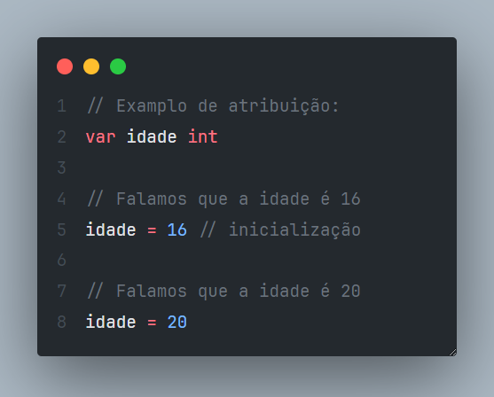
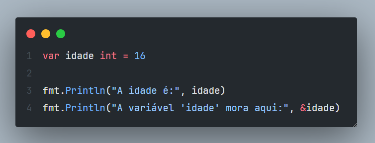
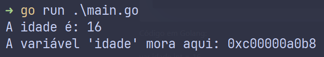

---

title: 'O que são variáveis e constantes'
pubDate: 2024-01-28T12:00:00.000Z
author: 'Kauê Fraga Rodrigues <rkauefraga@gmail.com>'
---

Veja a postagem do twitter/x [aqui](https://twitter.com/rkauefraga/status/1751298782975648026) e veja a postagem do tabnews [aqui](https://www.tabnews.com.br/kauefraga/o-que-sao-variaveis-e-constantes). Comentei [no TabNews](https://www.tabnews.com.br/kauefraga/o-basico-das-linguagens-de-programacao) também.

Tópicos abordados

- O que é uma variável
	- Referência a um pedaço de memória aleatória
	- Podem ser acessadas (leitura) ou alteradas (escrita)
	- Podem pertencer a um escopo
  - Podem ter um tipo
- Por que existe e usar
- Como usar uma variável
	- Declaração, atribuição, inicialização e definição

Olá! Tudo bem? Esse é o primeiro post de uma série sobre conceitos e funcionalidades elementares das linguagens de programação em geral. Meu objetivo é me aproximar da comunidade e ajudar explicando tópicos essenciais para começar a usar uma nova linguagem. Bora?

## O que é uma variável e por que usar?

Uma variável, em um programa, é uma referência a um pedaço (uma posição) de memória que guarda um valor. E geralmente vai ser usado no futuro.

Pense que uma variável é uma etiqueta colocada numa caixa que tem algo dentro e está em um montante de caixas. Alguém colocou aquelas caixas lá, mas o que importa é que você colou uma etiqueta e agora se você precisar daquela caixa específica você só precisa procurar pela etiqueta.

As variáveis existem para simplificar e possibilitar a criação de soluções mais complexas e flexíveis. Como você lembraria de algo específico como um valor númerico, um nome, um objeto inteiro? Como acessaria e manipularia dados de outro escopo? E dados vindos do usuário?

O @maniero escreveu algo interassante sobre variáveis em [uma resposta no Stack Overflow](https://pt.stackoverflow.com/q/181332), acho que vale a menção:

> "Variável é um **padrão de projeto** (_design pattern_) tão usado, tão simples, e tão presente em linguagens que ninguém enxerga assim. É um padrão para acessar uma posição da memória. Esse padrão torna independentes nome e valor. Isso cria várias oportunidades para expressar algoritmos complexos de forma **poderosa e flexível**."

Eu nunca tinha pensado em variáveis dessa forma e acho que faz muito sentido.

Já pensou como seria se variáveis não existissem? Acho que não daria pra ir tão longe sem enlouquecer completamente 😅😆.

## Como usar uma variável?

Uma variável tem algumas propriedades principais, são elas:

- Poder ser acessada (leitura)
- Poder ser alterada (escrita)
- Poder ter um tipo (número, ponto-flutuante, booleano, etc...)
- Poder pertencer a um escopo (um local do código)
- Poder ser declarada e atribuída

### Sintaxe

Vamos ver a estrutura de uma variável. A sintaxe pode ser um pouco diferente de linguagem para linguagem (vai ser), mas a ideia segue a mesma.

- Palavra reservada para DECLARAR a variável*
- Nome da variável
- Tipo da variável**
- Valor da variável***

> *Algumas linguagens de programação podem não ter palavra reservada para declarar variáveis ou ter e não ser necessária, falando a grosso modo.

> **Algumas linguagens conseguem inferir tipos automaticamente (pelo valor atribuído e/ou outras técnicas) e não têm especificação de tipos para o desenvolver utilizar (tipos sempre vão existir por de baixo dos panos). Outras linguagens tem especificação de tipos mas conseguem fazer inferência também, como Python e Go. Isso tem nome: linguagem fortemente tipada, fracamente tipada, estaticamente tipada ou dinamicamente tipada (cada um desses nomes descrevem comportamentos diferentes, acho que valeria um texto só para explicar esse tópico de tipagem das linguagens).

> ***O valor da variável não necessariamente precisa ser atribuído quando declaramos uma variável, salvo exceções.

Veja abaixo um exemplo em Golang:

### O que é declaração, atribuição, inicialização e definição?

Declaração e atribuição são métodos para dizer ao compilador/interpretador da linguagem de programação que uma variável precisa ser reservada e tem um valor, respectivamente.

Inicialização e definição por outro lado, são só nomenclaturas pra especializações.

**Declaração** (_declaration_) é quando você diz que uma variável deve existir pra ser usada no programa.

**Atribuição** (_assignment_) é quando você diz que determinada variável tem tal valor.

**Inicialização** (_initialization_) é uma espécie de atribuição. Quando você ATRIBUI um valor a uma variável pela primeira vez.

**Definição** (_definition_) é só uma forma de dizer que você está DECLARANDO e ATRIBUINDO de uma vez.

Veja um exemplo de cada:

## O que é uma constante?

Bom, você verá implementações um pouco diferentes em torno do que é uma constante. No geral, uma constante é uma espécie de variável que não varia durante toda a execução do programa, ou seja, você não pode alterar o valor de uma constante depois de defini-la no seu código. Isso significa que constantes não podem ser redefinidas, redeclaradas nem reatribuídas.

Alguns compiladores inclusive fazem o processo de inline das suas constantes, ou seja, onde elas forem referenciadas o compilador troca pelo valor delas em tempo de compilação, nesse caso, uma constante não tem um endereço na memória, não é uma espécie de variável, é apenas um valor no seu código que vai ser trocado em tempo de compilação. Legal, não?

## Fun fact

Se você usa uma linguagem que disponibiliza ponteiros e referências para uso, você pode ver onde sua variável "mora" na memória reservada, que eu comentei anteriormente, por exemplo:

Com esse código em Golang

Ao executar, você deve ver

Acho que é isso. Tentei abordar da maneira mais genérica para que quando você estiver dando os primeiros passos em determinada linguagem, você saiba mais ou menos o que pesquisar sobre variáveis e constantes.

Fez sentido pra você? Gostou da explicação? Se sim, considere um 👍. Se não, o que você acha que faltou?

Por sinal, a próxima publicação vai ser sobre estruturas condicionais, fica ligado! Obrigado por ler 💜.
