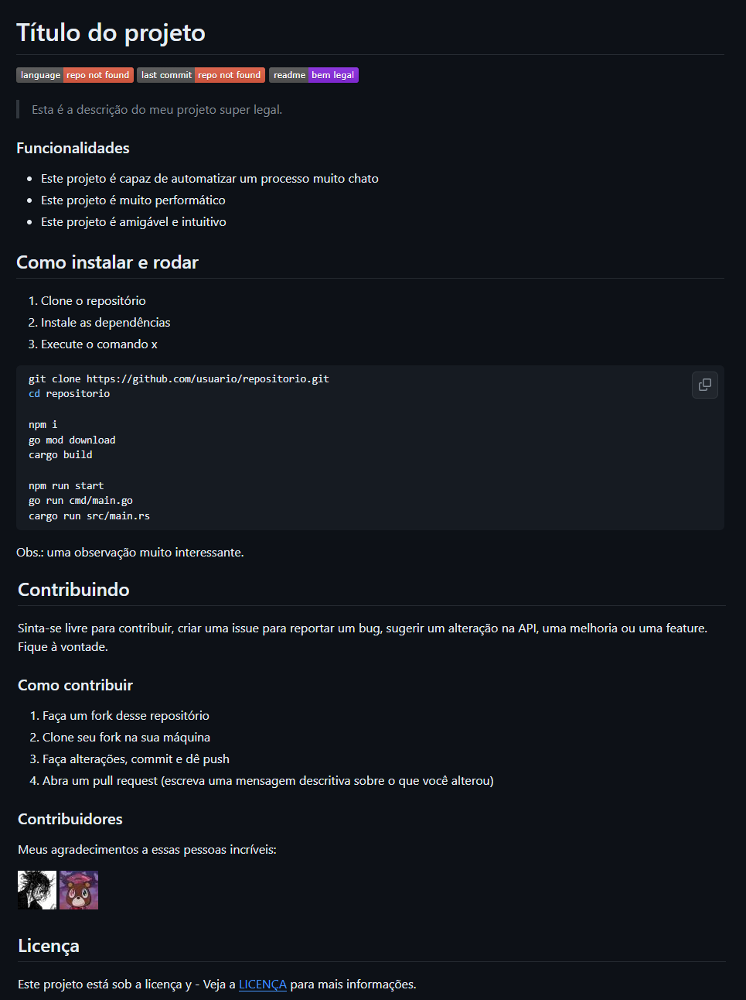

---

title: 'Personalizando o README do seu projeto'
publishDate: 2024-03-24
author: 'Kauê Fraga Rodrigues <rkauefraga@gmail.com>'
---

Opa, tudo tranquilo?

Continuando a série sobre READMEs, agora vamos falar da personalização 🤩

Vamos usar markdown para customizar o README do seu projeto com seções, frases, ícones/insígnias, etc. Se você não tem ideia do que é markdown e README, recomendo ler o primeiro artigo desta série, [Introdução ao markdown e aos READMES](https://www.tabnews.com.br/kauefraga/introducao-ao-markdown-e-aos-readmes).

## Estruturando o README

Pense no **modo que você quer expor as informações do seu projeto**. Defina uma hierarquia e use vários identificadores (seções, negrito, código...).

Depois de fazer alguns projetos e espiar um bocado de projetos alheios, eu normalmente estruturo meu projeto da seguinte forma:

1. Título ou nome do projeto
2. Descrição
3. Funcionalidades
4. Como instalar/rodar/usar
5. Licença

É isso! Simples, não?

Você pode adicionar mais informações, mas eu acredito que essas sejam essenciais.

Se você não sabe o que adicionar, pense em quais informações são importantes para o projeto. Eu tenho algumas sugestões:

- documente as tecnologias e a escolha delas
- descreva a arquitetura, os padrões de projetos e o porquê dessas decisões
- dedique uma seção a sua API (interna ou não)
- liste as variáveis de ambiente necessárias para executar o projeto
- exemplifique a utilização do projeto (código ou imagem/vídeo)
- explique os passos necessários para contribuir
- mencione os contribuidores
- diga se tem testes e como roda-los

## Estilizando essas informações com markdown

Fique atento, em algumas partes eu vou adicionar só a opção discutida (incremental mesmo) e em outras eu vou reescrever boa parte do código já mostrado porque alguma coisinha ali foi alterada.

### Especifique o título

**Dica**: tente criar um nome explicativo e memorável para o seu projeto, por mais difícil que isso seja 😅

```md
# Título do projeto
```

Centralizado:

```md
<h1 align='center'>Nome do projeto</h1>
```

Não é possível centralizar com markdown, por isso usamos HTML.

### Adicione insígnias legais ao seu projeto

Veja no site [shields.io](https://shields.io). Segue as que eu mais uso:

- Linguagem mais utilizada
- Último commit
- Palavras/frase estática
- Licença
- Downloads (GitHub releases, crates.io, npm...)
- Versão mais recente

```md
# Título do projeto


```

Centralizado:

```md
<div align='center'>
	<h1>Nome do projeto</h1>
	
	
	
</div>
```

Lembre-se de trocar as informações `:nomedeusuario` e `:nomedorepositorio`.

### Coloque uma descrição

```md
# Título do projeto


Esta é a descrição do meu projeto super legal.
```

Descrição como citação:

```md
> Esta é a descrição do meu projeto super legal.
```

Centralizado:

```md
<div align='center'>
	<h1>Nome do projeto</h1>
	<p>Esta é a descrição do meu projeto super legal.</p>
	
	
	
</div>
```

### Diga quais são as funcionalidades

As funcionalidades podem ser capacidades, rotas ou o que seu projeto fizer.

```md
### Funcionalidades

- Este projeto é capaz de automatizar um processo muito chato
- Este projeto é muito performático
- Este projeto é amigável e intuitivo
```

```md
## Features

- [x] Este projeto é capaz de receber requisições e responder
- [x] Este projeto é capaz de lidar com requisições simultaneamente, graças ao controle de concorrência implementado
- [ ] Este projeto pode teletransportar uma pessoa para qualquer lugar do planeta a qualquer momento
```

Perceba a alteração das palavras (funcionalidades e features), nível da seção (h3 e h2) e lista (não-marcada e marcada). Faça como quiser.

### Como instalar e rodar

Aqui você precisa descrever o processo de instalação e execução/utilização do seu projeto.

```md
## Como instalar e rodar

1. Clone o repositório
2. Instale as dependências
3. Execute o comando x

<----->bash
git clone https://github.com/usuario/repositorio.git
cd repositorio

npm i
go mod download
cargo build

npm run start
go run cmd/main.go
cargo run src/main.rs
<----->

Obs.: uma observação muito interessante.
```

Substitua esses `<----->` por crases triplas (bloco de código).

### Instrua contribuidores

Uma seção dedicada a como contribuir pode ser muito útil. Detalhe o processo de contribuição.

```md
## Contribuindo

Sinta-se livre para contribuir, criar uma issue para reportar um bug, sugerir um alteração na API, uma melhoria ou uma feature. Fique à vontade.

### Como contribuir

1. Faça um fork desse repositório
2. Clone seu fork na sua máquina
3. Faça alterações, commit e dê push
4. Abra um pull request (escreva uma mensagem descritiva sobre o que você alterou)
```

Mencionar os seus contribuidores e declarar sua gratidão é bacana também. Coloque o ícone dos seus contribuidores.

```md
### Contribuidores

Meus agradecimentos a essas pessoas incríveis:

[](https://github.com/notshwuy)
[](https://github.com/FelipeMCassiano)
```

### Exponha a licença

```md
## Licença

Este projeto está sob a licença y - Veja a [LICENÇA](https://github.com/usuario/repositorio/blob/main/LICENSE) para mais informações.
```

## Resultado final

Veja como ficou o README copiando e colando direto daqui:



Basicamente é isso. Lembra que o README é um "cartão de visitas" para o seu projeto? O que você quer mostrar aos seus visitantes? Você deve montar seu README pensando nas informações que são relevantes para o seu projeto. A partir disso, escreva e refine ao longo do tempo.

**Fun fact**: dependendo do lugar que você pretende colocar seu README (GitHub, GitLab, Bitbucket...) pode existir um *superset* do markdown como diz [o Markdown Guide em *extended syntax*](https://www.markdownguide.org/extended-syntax/#lightweight-markup-languages), que adiciona marcações e melhora o comportamento de algumas existentes.

Se você usa o Visual Studio Code para escrever seus READMEs, eu tenho extensões para recomendar:

- [Markdown Checkbox](https://marketplace.visualstudio.com/items?itemName=bierner.markdown-checkbox)
- [Markdown Emoji](https://marketplace.visualstudio.com/items?itemName=bierner.markdown-emoji)
- [Markdown Mermaid (diagramas e fluxogramas)](https://marketplace.visualstudio.com/items?itemName=bierner.markdown-mermaid)
- [Markdown GitHub Styles](https://marketplace.visualstudio.com/items?itemName=bierner.markdown-preview-github-styles)
- [Markdown Lint](https://marketplace.visualstudio.com/items?itemName=DavidAnson.vscode-markdownlint)

Também selecionei alguns dos meus melhores READMEs para você ter uma ideia de como eu faço:

- [esquilo aniquilador](https://github.com/kauefraga/esquilo-aniquilador)
- [eco](https://github.com/kauefraga/eco)
- [ariprog](https://github.com/kauefraga/ariprog)
- [anime archive](https://github.com/kauefraga/anime-archive)
- [node typescript server](https://github.com/kauefraga/node-typescript-server)

Obrigado por ler 💜
