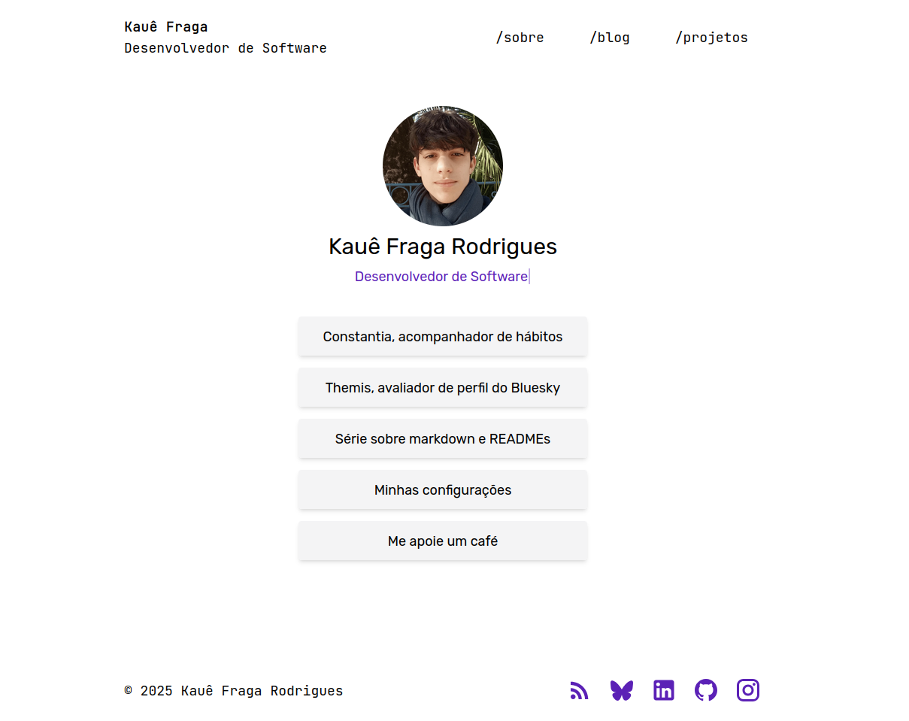
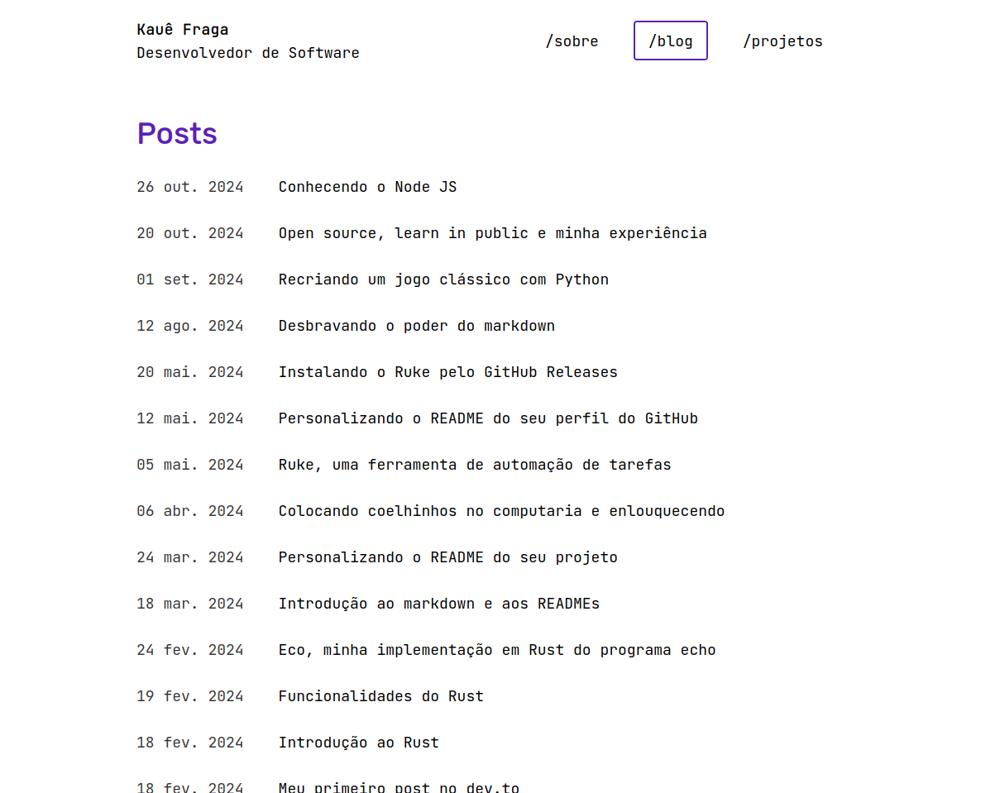
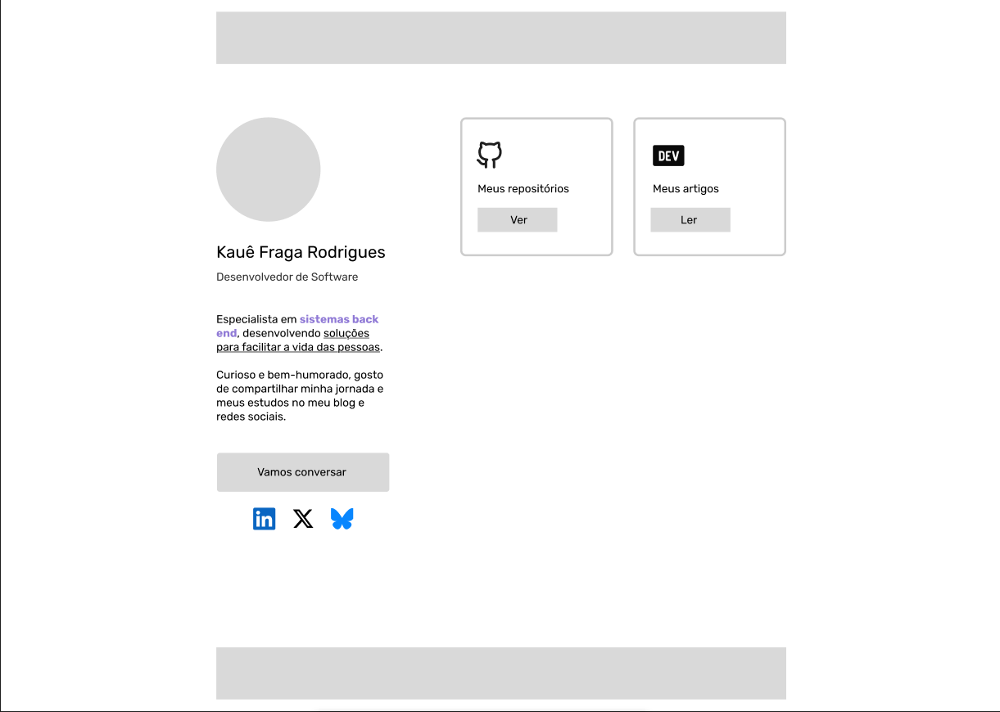

Olá! Espero que tenha começado o ano bem.

Em 2024 eu desenvolvi meu site pessoal do zero usando JavaScript e maisen... um framework chamado [Astro](https://astro.build/), acabei comprando o domínio [kauefraga.dev](https://kauefraga.dev) para dar mais credibilidade e usar no [Bluesky](https://bsky.app/profile/kauefraga.dev).

Minha ideia era ter um site para portfolio e para manter um blog, então fui construindo o projeto e pegando referências daqui e dali. Certo dia no Twitter vi um post do [Luke Berry](https://x.com/LukeberryPi) falando do [seu site](https://www.lukeberrypi.com/) e decidi me inspirar no conceito de *link tree* como página inicial.

Isso porque assim como o cabeçalho/header da página ajuda a navegar entre as páginas do site, o link tree serve para disponibilizar vários links sobre você em ordem, links esses que provavelmente não apontam para o seu site.

Dois aspectos interessantes e que eu peguei de outros sites são a fonte mono espaçada e a largura da página limitada (elemento raiz centralizado e com `max-width`, criando esse alinhamento) que eu acho muito bacana.

Essa semana eu atualizei alguns links da página principal e acabei fazendo outras alterações também, as principais foram:

- Atualizar a versão do Astro (v4 para v5) e corrigir o que quebrou
- Adicionar a estimativa de tempo de leitura
- Alterei as strings que são digitadas na página inicial

Mexendo no código do site e olhando pra ele, me lembrei que queria mudar o visual há algum tempo. E assim começou a jornada...

Criei um rascunho no Figma e comecei a juntar as ideias.

Eu queria manter o conceito da largura fixa, apenas aumentando um pouco o limite, entretanto gostaria de tirar boa parte da fonte mono espaçada.

Outra coisa que adoraria testar era um design com duas colunas principais (esquerda e direita) para colocar mais conteúdo escrito, além dos links.

O que é um site com múltiplas páginas sem cabeçalho/header para destacar a navegação logo no topo? Sinceramente, não sei.

Senti que precisava atualizar o cabeçalho também e procurando referências em plataformas que conheço, lembrei do [bento.me](https://bento.me/en/home), aqueles links mais bonitos me fascinaram.

Com esses detalhes consegui fazer um esboço da primeira página do site.

