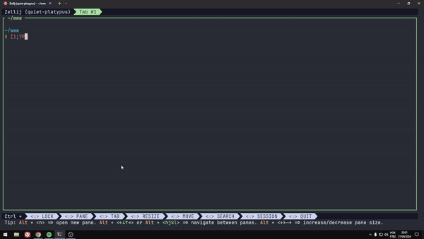
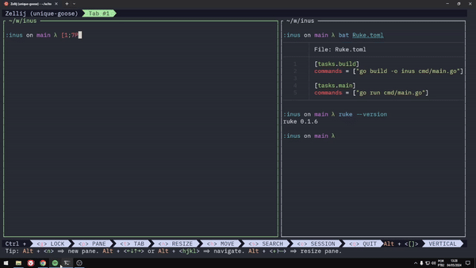

---

title: 'Ruke, uma ferramenta de automação de tarefas'
pubDate: 2024-05-05
author: 'Kauê Fraga Rodrigues <rkauefraga@gmail.com>'
---

Opa, tudo bem? Queria compartilhar um projeto que estou fazendo e mantendo.

O Ruke é uma ferramenta simples para automatizar tarefas de um projeto. Com ele, você pode definir uma tarefa com comandos que serão executados de maneira sequencial. Essas tarefas e comandos ficam em um arquivo [TOML](https://toml.io/en/) bem fácil de ler e configurar.

O projeto é feito em Rust e tem uma interface de linha de comando (CLI).

Veja uma demonstração do Ruke na versão 0.1.3.



## Escolhas importantes

Decidi desenvolver esse projeto usando Rust porque é uma linguagem de programação que estou aprendendo e ela tem uma boa reputação quanto a criação de ferramentas para desenvolvedores.

O Ruke foi totalmente inspirado pelo [GNU Make](https://www.gnu.org/software/make/) e pelo [just](https://github.com/casey/just), porém uma diferença relevante está na escolha do arquivo de configuração. Enquanto esses projetos citados optaram por ter um formato próprio, eu escolhi usar o TOML por alguns motivos:

- Dados os objetivos, não há necessidade de um controle total da implementação (sintaxe, funcionalidades, estruturas de dados).
- A diferença do esforço para os ganhos de escrever um parser próprio é drástica.
- Usar um formato simples e conhecido faz com que a curva de aprendizado seja mínima.

## E esse nome, veio de onde?

O nome "ruke" é uma combinação de "**ru**st" e "ma**ke**".

O primeiro nome era "rufile" de "**ru**st" e "make**file**", mas em [um post meu no Twitter](https://twitter.com/rkauefraga/status/1778574809384833043) o coelho [Jeff Quesado](https://twitter.com/JeffQuesado) comentou sobre o comando que seria utilizado e deu uma sugestão: `Makefile -> make`, `Rufile -> ruke`.

A partir desse momento, o projeto começou a se chamar `ruke` e o arquivo `Rukefile` (por implicações práticas, atualmente o arquivo principal é `Ruke.toml`).

## Primeiros contribuidores

Eu tenho pouquíssimos repositórios privados, tudo que fiz e faço gosto de deixar público para os outros verem, se inspirarem, sugerirem alterações ou melhorias.

> _Open source and build in public are the ways!_

Felizmente, conheci pessoas incríveis no Twitter (uma surpresa, não?) que me ajudaram e decidiram contribuir para o Ruke.

Uma delas já foi citada, o Jeff, que deu a ideia do nome.

O [Felipe Cassiano](https://twitter.com/fodasecassiano) foi o primeiro contribuidor do projeto em si, forkou, desenvolveu e mandou alguns pull requests. As mudanças mais significativas que ele fez foram:

- Implementar o comando `list` que serve para listar as tarefas existentes.
- Desenvolver os comandos `add` e `remove` que serviam para adicionar e remove tarefas do arquivo `Ruke.toml` (ainda existem mas foram modificados).
- Adicionar um modo interativo para os comandos `add` e `remove`.
- Implementar a troca da estrutura de dados principal de vetor para hash map.

E por último mas não menos importante, o [Shwuy](https://twitter.com/shwuydev), que implementou uma busca pelo arquivo `Ruke.toml` usando o iterador [`Ancestors`](https://doc.rust-lang.org/std/path/struct.Ancestors.html).

Essas contribuições agregaram na performance e, principalmente, na usabilidade da ferramenta.

Agradeço muito a eles por terem me ajudado a construir esse projeto (e não só), têm um espaço no meu coração. Foram **os primeiros contribuidores** de um projeto meu.

## Atualização mais recente

A última atualização do Ruke (0.1.6) incrementou ainda mais a usabilidade. Inspirado no [Bun](https://bun.sh/), modifiquei as saídas do executor de tarefa e do comando `list` para que apareçam mais informações úteis.

Dá uma olhada em como ficou.



Tenho gostado bastante do projeto pois adoro criar ferramentas para desenvolvedores e também porque está sendo útil para mim, tanto no âmbito do aprendizado quanto da utilização. Inclusive, estou usando o Ruke em um projeto full stack que comecei recentemente chamado [Inu](https://github.com/kauefraga/inus) (aquele ali em cima no gif, é o back end).

Caso tenha ficado interessado em testar o Ruke, recomendo que instale pelo [Cargo](https://doc.rust-lang.org/cargo/) usando o comando abaixo:

```bash
cargo install ruke
```

Para iniciar um arquivo de configuração, basta executar:

```bash
ruke init
```

Pra executar a tarefa "main", execute:

```bash
ruke # ou ruke main
```

Com o comando `ruke --help` você pode ver um menu de ajuda com os comandos que existem e o que eles fazem. O comando `ruke {comando} --help` irá mostrar mais detalhes de um comando específico.

Você pode aprender como adicionar tarefas e especificar comandos na documentação, nas seções ["Mastering the CLI"](https://github.com/kauefraga/ruke?tab=readme-ov-file#mastering-the-cli) e ["Mastering the Rukefile"](https://github.com/kauefraga/ruke?tab=readme-ov-file#mastering-the-rukefile) no [repositório do projeto](https://github.com/kauefraga/ruke).

Estarei aberto para dúvidas ou sugestões por aqui ou pelo [Twitter/X](https://twitter.com/rkauefraga) se preferir.

Muito obrigado por ter lido até aqui ❤🦀.

Fonte: [repositório do Ruke](https://github.com/kauefraga/ruke)
